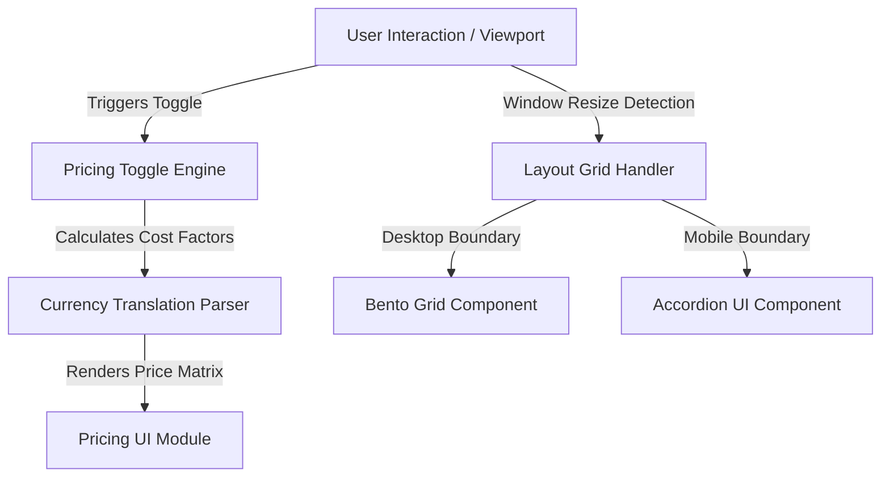
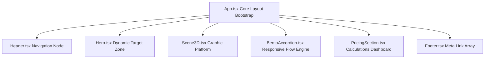

# 🪐 NeuroFlow — NextGen AI Platform

<p align="center">
  
  
  
  
  
</p>

<p align="center">
  
  
  
  
  
</p>

<p align="center">
  <strong>NeuroFlow</strong> is a premium, high-performance AI-powered SaaS application layout engineered with modern frontend practices. Designed to showcase an enterprise-grade AI Data Automation Platform, it features fluid design systems, rigorous component reusability, semantic orchestration, and optimal web performance interfaces.
</p>

<p align="center">
  <a href="#-project-overview">Project Overview</a> •
  <a href="#%EF%B8%8F-key-features">Key Features</a> •
  <a href="#%EF%B8%8F-project-architecture">Architecture</a> •
  <a href="#-installation--local-setup">Installation</a> •
  <a href="#%EF%B8%8F-performance-optimizations">Performance</a> •
  <a href="#-hackathon-journey">Hackathon Journey</a>
</p>

---

## 🖼️ Application Interface Banner


---

## 📑 Table of Contents

1. [Project Overview](#-project-overview)
2. [Why This Project?](#-why-this-project)
3. [Deployment & Repositories](#-deployment--repositories)
4. [Key Features](#%EF%B8%8F-key-features)
5. [Feature Highlights & Engineering Breakdown](#-feature-highlights--engineering-breakdown)
6. [Platform Previews](#-platform-previews)
7. [Tech Stack Matrix](#-tech-stack-matrix)
8. [Project Structure](#-project-structure)
9. [Installation & Local Setup](#-installation--local-setup)
10. [Project Architecture](#%EF%B8%8F-project-architecture)
11. [Design, Accessibility & Performance Systems](#-design-accessibility--performance-systems)
12. [Hackathon Journey & Retrospective](#-hackathon-journey--retrospective)
13. [Future Improvements](#-future-improvements)
14. [Contributing Guidelines](#-contributing-guidelines)
15. [License](#-license)
16. [Author & Connection Profiles](#-author--connection-profiles)

---

## 🌐 Project Overview

NeuroFlow provides a premium online presence for a fictional AI Data Automation Platform, capturing complex technological systems in a conversion-focused frontend interface. 

### 💡 Why This Project?
Modern SaaS marketing products demand an intersection of speed, immersive presentation, and bulletproof accessibility. NeuroFlow demonstrates how standard modern tools can be pushed to create rich interactive experiences—such as dynamic pricing models, hybrid layout adjustments, and multi-currency formatting adapters—without compromising loading speed or semantic document structure.

> **Production Metric Core Standard:** The codebase features 100% strict TypeScript typing, decoupled configuration states, modular Tailwind layouts, and cross-browser semantic element accessibility layouts.

---

## 🚀 Deployment & Repositories

| Target Resource | Production Location URL |
| :--- | :--- |
| **Live Production Demo** | [https://frontend-project-one-lovat.vercel.app/](https://frontend-project-one-lovat.vercel.app/) |
| **Source Repository Portal** | [https://github.com/Madhav0976/nextgen-ai-platform](https://github.com/Madhav0976/nextgen-ai-platform) |

---

## 🛠️ Key Features

* **✨ Premium Hero Section:** High-impact initial viewport utilizing deep layer layout styling, micro-interactions, and visual focus zones.
* **📱 Responsive Component Architecture:** Clean adjustments layout across screen resolutions via custom Tailwind break vectors.
* **⚙️ AI Product Feature Showcase:** Technical layout displaying modular system parameters and platform operational benefits.
* **📊 Interactive Dynamic Pricing Section:** State-driven payment tier view featuring billing interval toggles and currency conversion hooks.
* **🧩 Hybrid Layouts:** Adapts seamlessly between desktop grids and progressive mobile accordions for optimal readability.
* **♿ Built-in Accessibility Focus:** Accessible contrast scales, focus state management, and strict semantic HTML composition.

---

## 🔬 Feature Highlights & Engineering Breakdown

### Dynamic Billing Switching Matrix
The pricing engine uses highly decoupled state variables to handle fast mathematical mutations across alternative checkout models. 

```tsx
// Architectural reference pattern of currency-billing calculation matrices
const pricingConfig = {
  monthly: { USD: 49, EUR: 45, INR: 3999 },
  annual:  { USD: 39, EUR: 35, INR: 3199 }
};

```

### Fluid Hybrid Grid Switching Layout

Rather than merely resizing blocks on smaller viewports, the platform converts the desktop feature showcase into a clean mobile accordion module (`BentoAccordion.tsx`). This layout shift preserves structural flow and prevents layout shifting on mobile screens.

---

## 📸 Platform Previews

### Hero Viewport

*Immersive visual core layout featuring premium gradients, responsive navigation controls, and actionable focal buttons.*


### Data Automation Feature Showcase

*Multi-layered grid structures displaying architectural properties and complex data assets.*


### Adaptive Cost Analysis Modules

*Interactive pricing tables showcasing localized currency systems and flexible annual/monthly filters.*


### Responsive Mobile Interface

*Mobile-first viewport validation proving clean navigation layouts, fluid accordions, and tactile interaction surfaces.*


---

## 🧮 Tech Stack Matrix

| Layer Module | Chosen Framework | Operational Rationale |
| --- | --- | --- |
| **Core Client Framework** | `React 18` | Declarative, virtual-DOM processing for quick layout updates. |
| **Type Configuration** | `TypeScript` | Strict compile-time typing to eliminate runtime reference exceptions. |
| **Build Optimization** | `Vite` | Ultra-fast Hot Module Replacement (HMR) and optimized rollup production bundles. |
| **Style Management** | `Tailwind CSS` | Utility-first compilation that reduces CSS payload footprints. |
| **Motion Interfaces** | `CSS Keyframes` | Lightweight native animation layers that bypass heavy external JS script overheads. |
| **Edge Deployment Platform** | `Vercel` | Globally distributed edge hosting with integrated CI/CD deployment channels. |

---

## 📂 Project Structure

```text
src/
├── components/
│   ├── BentoAccordion.tsx   # Hybrid multi-state block to mobile layout converter
│   ├── Footer.tsx           # Standard semantic footer layout with categorized navigation links
│   ├── Header.tsx           # Fixed utility header managing mobile drawer transitions
│   ├── Hero.tsx             # Context marketing layout utilizing layout composition
│   ├── PricingSection.tsx   # Currency conversion matrices and billing toggle state machine
│   └── Scene3D.tsx          # Canvas/Visual anchor block managing decorative assets
├── App.tsx                  # Core layout bootstrap mounting layout modules
├── index.css                # Global style layer injecting specific utility vectors
└── main.tsx                 # Client application root hydration mounting node

```

---

## 🔌 Installation & Local Setup

### Prerequisites

* **Node.js:** `v18.x` or subsequent LTS editions
* **Package Manager:** `npm` or alternative runtime engine setups (`pnpm`/`yarn`)

### Run Locally

1. Clone the project and step into the workspace root:
```bash
git clone [https://github.com/Madhav0976/nextgen-ai-platform.git](https://github.com/Madhav0976/nextgen-ai-platform.git)
cd nextgen-ai-platform

```


2. Restore package dependency nodes:
```bash
npm install

```


3. Initialize the local development instance:
```bash
npm run dev

```


*The local server typically spins up on `http://localhost:5173`.*

### Build for Production

To package compile variables into hyper-optimized, minified chunks:

```bash
npm run build

```

The production assets are outputted to the local `dist/` directory, ready to be hosted on any static cloud web service layer.https://github.com/Madhav0976/GitPreview-AI/blob/main/LICENSE

---

## 🏗️ Project Architecture

### Functional System Stream Flow



### Component Parent-Child Topologies



---

## 🛠️ Design, Accessibility & Performance Systems

### 📱 Responsive Design Matrix

Rather than relying solely on auto-scaling fluid boxes, specific elements implement alternate layout forms based on viewport thresholds. Font sizes scale using standard dynamic tracking (`text-base md:text-xl lg:text-2xl`), matching layout behaviors across small, tablet, and widescreen environments.

### ♿ Accessibility (a11y) Best Practices

* **Semantic Outlining:** Strict avoidance of layout wrapper anti-patterns by utilizing explicit semantic landmarks like `<header>`, `<main>`, `<section>`, and `<footer>`.
* **Contrast Controls:** Font values use color combinations that comply with WCAG AA visibility standards, maintaining legibility across dark ambient environments.
* **Keyboard Navigation Support:** High-interaction form items incorporate standard `:focus-visible` pseudo-states to assist assistive hardware controllers.

### ⚡ Performance Optimizations

* **Native Component Leveling:** Keeps individual file profiles lightweight, preventing unintended re-renders across parent components.
* **Elimination of Animation bloat:** Uses lightweight, pure CSS transformations (`will-change`, `transform`, `opacity`) to tap into GPU hardware acceleration. This ensures smooth, 60fps animations without loading resource-heavy JavaScript execution scripts.

---

## 🏁 Hackathon Journey & Retrospective

### Context

NeuroFlow was built under tight deadlines as part of the **Unstop Frontend Hackathon**. The goal was to build a highly responsive, pixel-perfect SaaS product showcase using modern UI engineering principles.

### Engineering Challenges Faced

1. **The Mobile Screen Layout Problem:** Standard bento-box layouts look great on desktop monitors but lose their readability when squeezed onto small mobile screens. Converting these components into an interactive, mobile-optimized accordion setup (`BentoAccordion.tsx`) solved the issue, keeping the content clean and structured without adding layout shifting.
2. **The Animation Trade-off:** Adding heavy external motion libraries caused noticeable frame drops during early tests. Moving to pure CSS custom keyframes fixed the issue, keeping the experience highly interactive while maintaining smooth performance metrics across lower-powered devices.

### Key Takeaways

* Leveraging utility systems like Tailwind helps maintain consistent styling patterns under tight development timelines.
* Thinking through responsive layouts early prevents layout problems when adapting complex grids for mobile viewports.

---

## 🗺️ Future Improvements

* [ ] Add an end-to-end theme system allowing users to toggle between crisp light modes and premium dark modes.
* [ ] Implement robust localization modules (`i18next`) for seamless, multi-language translation management.
* [ ] Add explicit automated unit coverage testing across pricing components using `Vitest` and `React Testing Library`.
* [ ] Migrate static asset references to remote content delivery networks (CDNs) for faster asset delivery.

---

## 🤝 Contributing Guidelines

Contributions are welcome! Please follow this structured contribution workflow:

1. **Fork the Project:** Create your target fork from the master repo stream.
2. **Isolate Development:** Create an explicit feature branch (`git checkout -b feature/AmazingFeature Enhancement`).
3. **Commit Validations:** Record clean changes using logical commit notes (`git commit -m 'feat: implement functional accessibility tracking hooks'`).
4. **Push Work:** Push the local branch up to origin (`git push origin feature/AmazingFeature`).
5. **Open Pull Request:** Initiate a review process using a detailed Pull Request description.

---

## 👨‍💻 Author & Connection Profiles

**T. V. Bindu Madhav**
*Computer Science & Engineering Student | Full Stack Developer | AI/ML Enthusiast*

* **GitHub:** [@Madhav0976](https://www.google.com/search?q=https%3A%2F%2Fgithub.com%2FMadhav0976)
* **LinkedIn:** [in/madhavtanguturi](https://www.google.com/search?q=https%3A%2F%2Flinkedin.com%2Fin%2Fmadhavtanguturi)

---

## 📄 License

This project is licensed under the MIT License - see the [LICENSE](https://github.com/Madhav0976/nextgen-ai-platform/blob/main/LICENSE) file for details.

